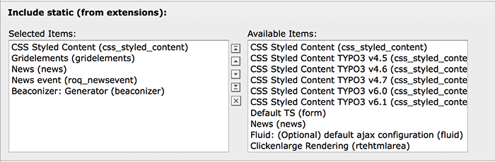

.. ==================================================
.. FOR YOUR INFORMATION
.. --------------------------------------------------
.. -*- coding: utf-8 -*- with BOM.

.. include:: ../Includes.txt

Installation
------------

Requirements
^^^^^^^^^^^^

- Supported TYPO3 versions: 7.6 - 9.5

Installation
^^^^^^^^^^^^

Eiter import the extension from TER or install it with composer (digicademy/beaconizer).
It will add two new tables to the system (*tx_beaconizer_domain_model_providers* and
*tx_beaconizer_domain_model_links*).

Include the static TypoScript of this extension in your TS template:

Depending on your use case can now create a scheduler task for harvesting links
or put the BEACON generator / seeAlso plugins on your pages.

For the two plugins you need to provide some additional TypoScript mapping. Please
refer to the according sections in the "Setup" chapter of this documentation.
