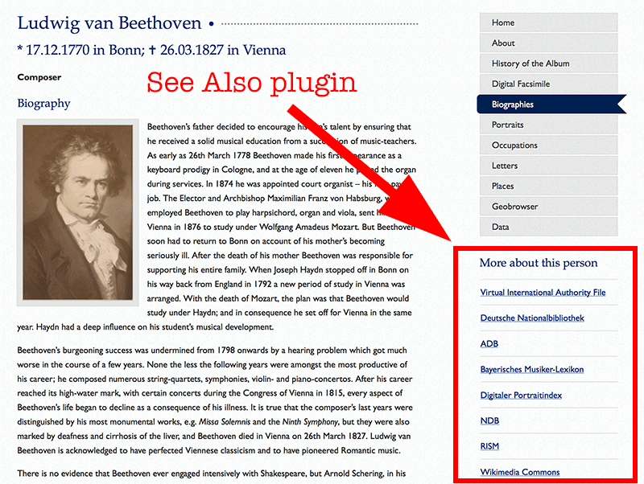

.. ==================================================
.. FOR YOUR INFORMATION
.. --------------------------------------------------
.. -*- coding: utf-8 -*- with BOM.

.. include:: ../Includes.txt

Introduction
------------

What does it do?
^^^^^^^^^^^^^^^^

With the TYPO3 Beaconizer you can harvest links from authority files (BEACON files), automatically enrich
your website content with related links ("see also" links) and open your data to external applications
with dynamically generated BEACON files.

BEACON is a simple text based file format to exchange hyperlinks. A BEACON file
contains a 1-to-1 (or 1-to-n) mapping from normdata identifiers to links. Each link consists of
an URL with an optional annotation (read `more about BEACON files and their purpose in the English
Wikipedia <https://meta.wikimedia.org/wiki/Dynamic_links_to_external_resources>`_).

A BEACON file connects your TYPO3 pages and data to the outside world via harvestable links. At the same
time you can provide your users with context related links in your detail views. Have a look at
`this poster <http://eprints.rclis.org/15407/2/isi2011_beacon_poster.pdf>`_ which explains the
benefits of using BEACON.

Features
^^^^^^^^

The TYPO3 Beaconizer consists of three components:

- a scheduler job for harvesting links from BEACON files

- a BEACON generator for your data (you can map any TYPO3 table)

- a seeAlso plugin that generates context related links for authority identifiers

Screenshots
^^^^^^^^^^^

The SeeAlso plugin automatically enriches your detail views with links to further information
"""""""""""""""""""""""""""""""""""""""""""""""""""""""""""""""""""""""""""""""""""""""""""""

Scheduler task for harvesting link data from BEACON file providers
""""""""""""""""""""""""""""""""""""""""""""""""""""""""""""""""""

.. figure:: ../Images/scheduler-task.png
   :alt: Scheduler task

Credits
^^^^^^^

This extension is developed by the `Digital Academy <http://www.digitale-akademie.de/>`_
of the `Academy of Sciences and Literature | Mainz <http://www.adwmainz.de>`_ for
our `Digital Humanities Projects <http://www.digitale-akademie.de/projekte/matrix.html>`_.

Join development
^^^^^^^^^^^^^^^^

Collaborative development of the TYPO3 Beaconizer takes place on `Github <https://github.com/digicademy/beaconizer>`_.
You are very welcome to join in and submit pull requests.
