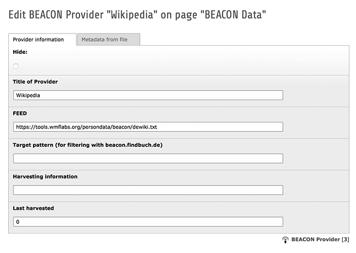

.. ==================================================
.. FOR YOUR INFORMATION
.. --------------------------------------------------
.. -*- coding: utf-8 -*- with BOM.

.. include:: ../../Includes.txt

Creating providers
------------------

The first step for beaconizing your data is to create one or more BEACON providers in
your TYPO3 backend. A "provider" is understood as an entity that offers a
BEACON file on the web. Provider records are essential for *link harvesting* with the
TYPO3 scheduler as well as for the *SeeAlso plugin* if you would like to filter results.

Give the provider a title (this will be used as text in "see also" links) and then enter
the URL of the provider's BEACON file in the *FEED* field. `A list of BEACON files
can be found in the German Wikipedia <http://de.wikipedia.org/wiki/Wikipedia:BEACON>`_.
You can leave all other fields empty for the moment.

The *Harvesting information* and *Last harvested* fields will get filled automatically once
the scheduler task starts harvesting the BEACON file of this provider. The *Metadata from
file* tab holds all official BEACON metadata fields from the `specification
<http://gbv.github.io/beaconspec/beacon.html#meta-fields>`_. The fields are readonly because
they will get filled by the scheduler task during harvesting.

The *Target pattern* field is only relevant if you want to filter links by specific providers
in your *SeeAlso plugin* when used together with the *beacon.findbuch.de* webservice.
