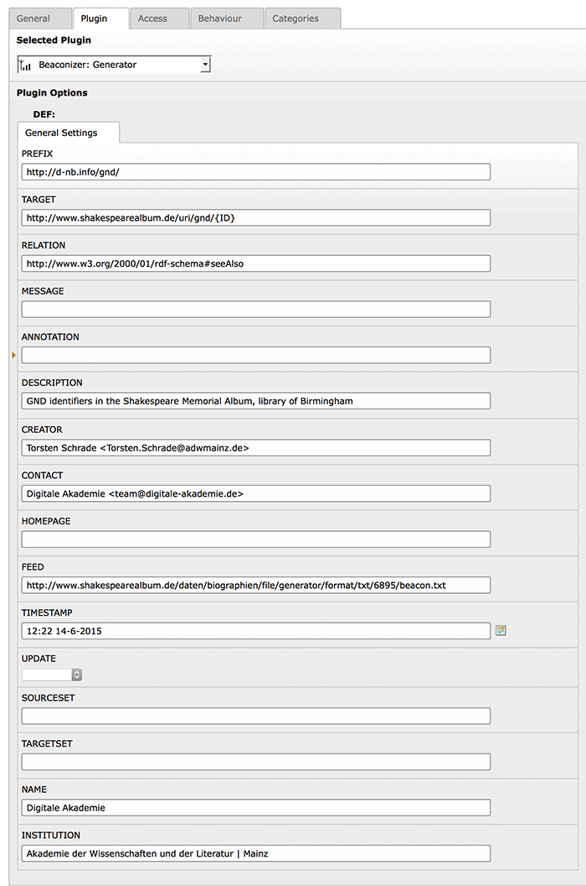

.. ==================================================
.. FOR YOUR INFORMATION
.. --------------------------------------------------
.. -*- coding: utf-8 -*- with BOM.

.. include:: ../../Includes.txt

Generator plugin
----------------

With the Beaconizer's generator plugin you can create BEACON files for any of your tables
with a simple TypoScript mapping. The plugin offers the generated BEACON files on a
separate page type (1789) in plaintext format. The generator is an extbase plugin so the output
is completely configurable with Fluid.

Here you can see an example BEACON file generated by the Beaconizer:

`<http://gutenberg-biographics.ub.uni-mainz.de/gnd/personen/beacon/file.txt>`_

Requirements for generating BEACON files
^^^^^^^^^^^^^^^^^^^^^^^^^^^^^^^^^^^^^^^^

You only need two things for generating BEACON files:

1) A unique identifier for each record, ideally from one of the national or international authority files (`GND <https://en.wikipedia.org/wiki/Integrated_Authority_File>`_, `VIAF <https://viaf.org/>`_, `Library of Congress <http://id.loc.gov/authorities/names.html>`_ etc.)

2) A stable URL pointing to a detail view of each record

Of course it is no obligation to use identifiers from authority files. BEACON files can
also be used "internally", for example for sharing links between two applications. Therefore you
could just use the uid of the records as identifier. The generator plugin puts no restriction on you
in this respect.

Mapping with TypoScript
^^^^^^^^^^^^^^^^^^^^^^^

Once you have (authoritative) source identifiers for your data you need to provide a simple
mapping for the generator plugin in a TypoScript template. Make sure you have included
the basic TypoScript of the Beaconizer in your root template. Next you need
to map your table to the Beaconizer's *GeneratedLinks* domain object:

::

  plugin.tx_beaconizer_generator {
    persistence {
      classes {
        ADWLM\Beaconizer\Domain\Model\GeneratedLinks {
          mapping {
            tableName = MY_TYPO3_TABLE
            columns {
              MY_SOURCE_IDENTIFIER_FIELD.mapOnProperty = sourceIdentifier
            }
          }
        }
      }
    }
  }

Substitute MY_TYPO3_TABLE and MY_SOURCE_IDENTIFIER_FIELD accordingly. In concordance with the BEACON
specification the Beaconizer's *GeneratedLinks* domain object also includes the other two (optional)
properties, namely the annotation and the targetIdentifier property. You can map these two
properties to other fields of your table.

From version 1.0.0 of the TYPO3 Beaconizer it is possible to generate BEACON files for TYPO3 pages. The
Beaconizer provides a new field *source_identifier* for the *pages* table that you can use for entering
identifiers from authority files. Please read the tutorial section in this manual that explains a very
simple use case for this feature.

Plugin settings
^^^^^^^^^^^^^^^

As soon as the TypoScript setting is in place you can put a Generator plugin on an empty page.
Don't forget to select the page(s) where you keep the data you would like to output as BEACON
file in the "Record Storage Page" field of the plugin. Finally fill out the metadata fields
in the plugin's flexform:

When this is done you can open up your page in the Frontend. The plugin should automatically
redirect you to the plaintext pagetype (1789) and output your data in BEACON format.

Fluid template
^^^^^^^^^^^^^^

The output of the generator plugin is done with a Fluid template that you will find in

::

  beaconizer/Resources/Private/BEACON/Templates/Generator/Beacon.txt

The records of your mapped table will become available as {link} objects in the template. The
metadata fields of the plugin will be available as {settings.meta.FIELDNAME}.