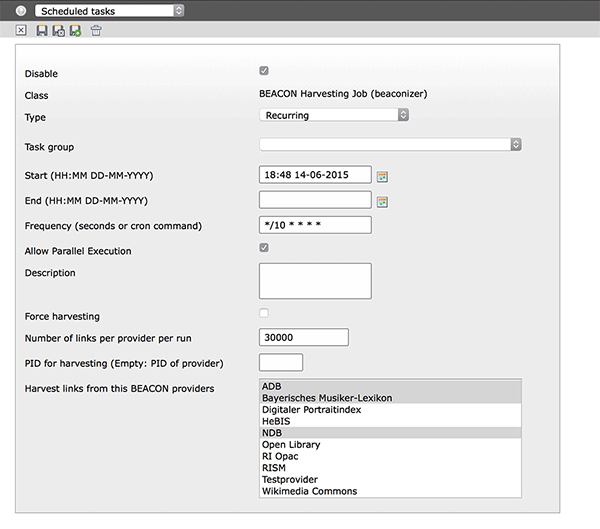
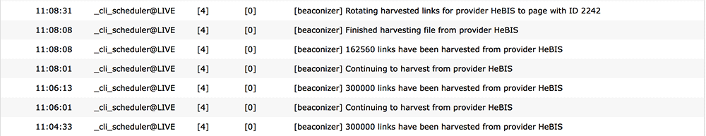
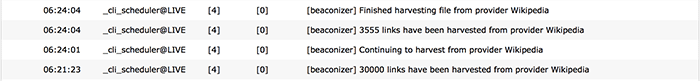

.. ==================================================
.. FOR YOUR INFORMATION
.. --------------------------------------------------
.. -*- coding: utf-8 -*- with BOM.

.. include:: ../../Includes.txt

Harvesting BEACON links
-----------------------

There are millions of links out there offered by libraries, cultural heritage organisations
and other initiatives via BEACON files. How can you make use of this? Lets say you have a set of
biographies about persons on your website. Once you have equipped your records with identifiers
from an authority file (for example from the `GND <https://en.wikipedia.org/wiki/Integrated_Authority_File>`_,
the authority file of the German National Library), it becomes possible to connect your
biographies to other resources on the web that share the same identifier.

One possibility is to embed a `BEACON webservice <http://beacon.findbuch.de/seealso/pnd-aks>`_
in the context of your TYPO3 application (check out the *SeeAlso plugin* of the
Beaconizer, it can do this for you). In case you want to be independent from any webservice,
the second possibility is to collect the BEACON files of your choice, parse them and regularly
import their information into your TYPO3 database. This is what the scheduler task of the
Beaconizer does.

Setting up the scheduler task
^^^^^^^^^^^^^^^^^^^^^^^^^^^^^

Go to the scheduler module and create a new *BEACON Harvesting* task.

Set a frequency and select the provider(s) you would like to harvest in the selector
box. That's it.

According to the specification, a BEACON aggregator should check the TIMESTAMP and/or UPDATE fields
in the BEACON files for when to update the local copy of the data. The Beaconizer does this on each
run of the scheduler. If the timestamp in the remote file is newer than the timestamp in the local
provider record, the file is reharvested. If there is no timestamp but an UPDATE field, this is taken
as basis for when to harvest a BEACON file again.

Here is an overview over the other settings in the scheduler task:

Force harvesting
  Once set, the files of the selected providers will always be harvested on each run

Number of links per provider per run
  By default the Beaconizer fully harvests all links of a given BEACON file. Since a file can contain
  millions of links this can put your server and your database under some stress.
  To avoid generating too much load you can specify a maximum number of links that should be
  harvested with each scheduler run. In case the scheduler task reaches this limit, it will stop the
  import, keep a temporary copy of the BEACON file and set a pointer to the position in the file where
  it stopped the import. On the next run it will continue to harvest links from this position
  until the file has been fully harvested

PID for harvesting
  By default, harvested links are placed on the same page where the provider record is kept. Here you
  can specify a different page

Harvesting strategies
^^^^^^^^^^^^^^^^^^^^^

Depending on your use case it can happen that you need to harvest huge BEACON files containing
millions of links. For such scenarios the next section tries to give you some recommendations.

Link rotation
"""""""""""""

The scheduler task regularly checks if a BEACON file from a provider should be reharvested.
If this is the case, the Beaconizer *will keep all existing links of the provider* until the file has
been fully harvested again. This is necessary because you certainly don't want your *SeeAlso plugins*
to generate empty output while a BEACON file is being reharvested. During harvesting all links
are kept in a hidden state on the root page of your TYPO3 installation until the file is fully reharvested.
Then a *link rotation* takes place. During the link rotation, the 'old' links will be deleted and the new
links will be pushed from the root page to the target page in your page tree.

Memory settings and database performance
""""""""""""""""""""""""""""""""""""""""

BEACON files can contain several millions of rows. Importing them in one turn can be a risky idea.
The scheduler task has been crafted to work as efficiently as possible. Nevertheless you
should keep an eye on your memory consumption and database settings. The following settings are
of particular relevance for the Beaconizer's scheduler task

memory_limit (PHP)
  Since the scheduler runs via CLI by default there should be no memory limit in place. But this also
  means that if you import a million links in one turn, the process will take a lot of memory
  and possibly the server load will go through the roof
max_allowed_packet (MySQL)
  This setting is very important. For the best import performance, the scheduler
  task does not import the links one by one (which could possibly mean a million database statements)
  but collects them first and then issues a bulk insert statement at the end of each provider run. If
  you harvest more than approximately 150.000 links per turn per provider you might hit the size limit
  of MySQLs *max_allowed_packet* setting (which is 16M by default). It is advisable to raise the value
  to at least 64M or even better 128M
innodb_pool_buffer_size (MySQL)
  In case your link table get's very large (several millions of rows) it might be a good idea to
  increase this setting to a value of 256M or even 512M. It will increase the speed of DELETE and UPDATE
  statements that are performed during link rotation

Generally, it might take you a little while to figure out the right trade off between the maximum number of
links to import per provider each turn. To give you some figures for a start: In our setting (simple
development machine, not tuned specifically, 2 cores, 4 GB RAM, max_allowed_packets 128M,
innodb_pool_buffer_size 512M) we set up a task to import 300.000 links every 2 minutes. For the test we
choose the `HeBIS file (8.9MB) <http://resolver.hebis.de/wikimedia/pndresolver/beacon.txt>`_ which contains
762.561 links. This was a reharvesting run which means that the database already contained the same number
of links from a former harvesting task. Here is the scheduler log (task starting at 11:04):

As you can see it took 33 seconds in the first run to download the file, open it, read 300.000 lines and
import them into the database. On the second run it just took 12 seconds to read the next 300.000 lines
from the already downloaded, temporary file and import them into the database. The import in the third run
just needed 7 seconds to complete as there were only 162.560 lines left in the BEACON file to be imported.
At this point the database contained 1.525.122 rows ('old' links and freshly harvested links). It took the scheduler
another 23 seconds to rotate the links (deleting 762.561 'old' links and moving 762.561 new links from the
root page to the provider's page). In sum it took 75 seconds to download, process and import the HeBIS file
and around 4.5 minutes in total since the scheduler task was set to repeat every two minutes.

One task per provider or one task for multiple providers
""""""""""""""""""""""""""""""""""""""""""""""""""""""""

Since it is possible to select more than one provider in the scheduler task the question arises
if it makes any difference to create one task per provider or let them all be harvested by one task.
As often, the answer is that it depends on your use case. Putting providers in separate tasks enables you to
set different harvesting intervals for each BEACON file. On the other hand, grouping providers in one
task can help in keeping an overview on what gets harvested and when.

Also file size can play an important role. It is cheaper to put a very large BEACON file in a separate task
and harvest it with a lesser number of links each turn than to stuff it in a task where
smaller BEACON files get harvested in full. The best thing is to try a bit, watch
the system log and find out which strategy is working best for your scenario.

Also there might be the need to create separate harvesting tasks for BEACON files that provide no
timestamp information and therefore need the *force harvesting* flag set.

Reharvesting a provider from scratch
""""""""""""""""""""""""""""""""""""

When a BEACON file is harvested the Beaconizer downloads the file and puts a copy of it into
the typo3temp directory. Once all links have been harvested the temporary file is deleted.
The Beaconizer keeps track of the state of files in the *Harvesting information* and *Last harvested*
fields of each provider record.

There can be situations (for instance if the typo3temp directory gets deleted while there are
still BEACON files to be harvested in it) where it makes sense to completely start from
scratch for a specific provider. All you need to do is to delete the harvesting
information in the provider record and set the "Force harvesting" flag in the according
scheduler task.

Monitoring harvesting
^^^^^^^^^^^^^^^^^^^^^

The scheduler tasks of the Beaconizer log their activity to the system log. This way
it's easy to observe what the current status of a harvesting task is and if everything
goes according to plan.

