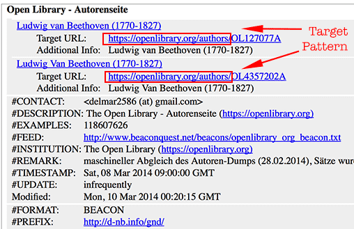

.. ==================================================
.. FOR YOUR INFORMATION
.. --------------------------------------------------
.. -*- coding: utf-8 -*- with BOM.

.. include:: ../../Includes.txt

SeeAlso plugin
--------------

The purpose of the SeeAlso plugin is to enhance your detail views with context related links.
The plugin performs a lookup based on identifiers, either against the harvested links in your
TYPO3 database or against the `beacon.findbuch.de <http://beacon.findbuch.de/seealso/pnd-aks>`_
webservice. It can be bound to any detail view of any Extbase extension and to regular TYPO3
pages.

.. figure:: ../../Images/see-also.png
   :alt: SeeAlso plugin

From version 1.0.0 of the TYPO3 Beaconizer it is also possible to use the plugin not only
for extension records but also for regular TYPO3 pages. Please read the tutorial section in this
manual for further information.

Requirements for the SeeAlso plugin
^^^^^^^^^^^^^^^^^^^^^^^^^^^^^^^^^^^

You will need two things for the *SeeAlso plugin* to work:

1) Authoritative identifiers in your records from one of the national or international authority files (`GND <https://en.wikipedia.org/wiki/Integrated_Authority_File>`_, `VIAF <https://viaf.org/>`_, `Library of Congress <http://id.loc.gov/authorities/names.html>`_ etc.).

2) A URL argument from which the currently displayed object can be inferred (uid etc.)

How it works
^^^^^^^^^^^^

The *SeeAlso plugin* should be placed on the page with the detail view on which
you would like to show "SeeAlso" links. You need to provide a simple TypoScript
mapping (see below). Once set, the plugin will keep an eye on the incoming URL arguments
and once it spots the argument that you have mapped as identifying argument for
your objects, it will fetch the record from the database, take the value of the
field that you have mapped to be the authoritative identifier and perform a *SeeAlso
lookup*, either against your harvested links or against the webservice.

Mapping with TypoScript
^^^^^^^^^^^^^^^^^^^^^^^

The *SeeAlso plugin* needs a simple TypoScript mapping to determine the currently displayed
object. Put the following in your template:

::

  plugin.tx_beaconizer_seealso {
    settings {
      objectMapping {
        VENDOR\MyExtension\Domain\Model\MyObject {
           pluginNamespace = tx_myextension_myplugin
           argumentName = myArgumentName
           sourceIdentifierProperty = myProperty
        }
      }
    }
  }

You can map any object by using the according classname. Below the classname you have to set the
following three options:

pluginNamespace (optional)
  This is the plugin namespace of the "other" plugin on the page that shows the detail
  view
argumentName (mandatory)
  This is the argument name of the detail view that contains the uid or identifier of
  the object by which the *SeeAlso plugin* will try to fetch the record from the database.
  Do not confuse this with the authoritative identifier (see next property)
sourceIdentifierProperty (mandatory)
  This property contains the authoritative identifier (GND, VIAF, etc.) for the
  object. The *SeeAlso lookup* will be performed using this value

Plugin settings
^^^^^^^^^^^^^^^

Once the TypoScript mapping is in place you can configure the plugin as follows:

First and foremost don't forget to select the page(s) where you keep your records in
the *Record Storage Page* field of the plugin. You then have the choice to configure
the *SeeAlso lookup* either against your database (for this you have to harvest links with
the Beaconizer's scheduler task) or against the webservice at *beacon.findbuch.de*.

Filtering results
^^^^^^^^^^^^^^^^^

The *Providers for lookup* setting makes it possible to filter the result for links
that only belong to specific providers.

Filtering harvested links
"""""""""""""""""""""""""

In case you have set the plugin to work with harvested links, filtering is very easy.
Just select the providers for which you would like to include links in your SeeAlso
output. Nothing else needs to be done. If the select box is left empty, harvested
links from all providers will be taken into account during the lookup.

Filtering links returned by the webservice
""""""""""""""""""""""""""""""""""""""""""

In case you use the *beacon.findbuch.de* webservice you have to take a different approach.
This is necessary because the webservice just returns any link found for a given identifier
and there is no direct connection to the BEACON providers in your TYPO3 backend and the
webservice . So how do we filter then? The answer is: With a pattern comparison on the
returned links.

Since each target identifier for a given provider has a specific and unique link structure
(i.e. the domain name and parts of the path to the resources) you can "bind" a provider
record in your TYPO3 backend to the links coming back from the webservice.

Check out these illustrations for the *Open Library* provider:

In this case all links to *Open Library* start with https://openlibrary.org/authors/.
If you insert this pattern into the *Target pattern"* field of your *Open Library* provider
record, a string comparison will be done during the lookup action and only if a link
starts with the same pattern the link will be included in the result.

Fluid template
^^^^^^^^^^^^^^

The output of the *SeeAlso plugin* is done with a Fluid template that you will find in

::

  beaconizer/Resources/Private/HTML/Templates/SeeAlso/LookUp.html

Any links found are available as {link} objects in the template.
