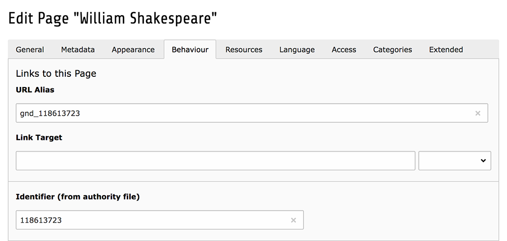

.. ==================================================
.. FOR YOUR INFORMATION
.. --------------------------------------------------
.. -*- coding: utf-8 -*- with BOM.

.. include:: ../Includes.txt

Tutorial
--------

This tutorial will show you how you can use the TYPO3 Beaconizer to create
a BEACON file out of your TYPO3 pages and how to enhance the content with seeAlso links.
We will use the most easy setup with regular TYPO3 pages. Using the Beaconizer with
extbase records follows the same principles explained in this tutorial.

Here the scenario: our TYPO3 website contains some biographies of some famous poets:
William Shakespeare, Franz Kafka and James Joyce. The biographies are just regular
TYPO3 pages with content elements. Since there are many sites on the web that contain
information about our poets we want to achieve two things:

- Share the links to our biographies with the outside world in a machine readable format
- Enhance our biographies with links to other sources about each poet so that our users
  can get more information when they read our content

We have the following page tree:

So there is a page for each poet below the "Pages" folder that contains each biography.
The first thing we need to do is to get an identifier for each poet from an authority file.
In our case we will be using the identifiers from the German national library. Identifiers
for persons can be looked up using the regular search form on the libraries website. Here are
the three identifiers we need:

- William Shakespeare: `118613723 <http://d-nb.info/gnd/118613723>`_
- Franz Kafka: `118559230 <http://d-nb.info/gnd/118559230>`_
- James Joyce: `118558501 <http://d-nb.info/gnd/118558501>`_

The TYPO3 Beaconizer inserts a new field *source_identifier* in the page properties that can
be used to enter an authority file identifier for each page.

Please note that we not only enter the identifier for each poet but also equip the *alias field*
of each page with a prefixed version of each identifier. By doing this we create automatic redirects
to each biographiy page just with plain TYPO3 standard functionality (the field needs to be prefixed
with letters since it should not contain numbers only - that could theoretically lead to an uid/alias
conflict.

So from now on each of our biography pages can be reached with a direct link:

- http://example.org/index.php?id=gnd_118613723
- http://example.org/index.php?id=gnd_118559230
- http://example.org/index.php?id=gnd_118558501

We are now ready to generate a BEACON file out of these pages that will communicate those links to the
outside world.

Generate a BEACON file out of TYPO3 pages
^^^^^^^^^^^^^^^^^^^^^^^^^^^^^^^^^^^^^^^^^

After having included the static TypoScript of the TYPO3 Beaconizer in our root template we
insert a plugin on the "Generator > Pages" page. It is of the type "Beaconizer: Generator".
We leave the PREFIX and the RELATION fields at their default values. For the TARGET field we
create a pattern out of the link alias combination from above that can be used by external
applications to dynamically compose links to our pages with the biographies:

::

  http://example.org/index.php?id=gnd_{ID}

Then we select the parent page of our biography pages as record storage page in the plugin.
Finally we need to map the pages table and its *source_identifier* field to the *sourceIdentifier*
field of the *Generated Link* class of the Beaconizer extension.

::

  plugin.tx_beaconizer_generator {
    persistence {
      classes {
        ADWLM\Beaconizer\Domain\Model\GeneratedLinks {
          mapping {
            tableName = pages
            columns {
              source_identifier.mapOnProperty = sourceIdentifier
            }
          }
        }
      }
    }
  }

That's it. When we now open the page with the BEACON-Generator plugin a text file will be displayed
containing the information from the plugin and the three identifiers from the pages table. This file
could now be registered with a BEACON service and evaluated by other applications.

Enhance TYPO3 pages with SeeAlso links
^^^^^^^^^^^^^^^^^^^^^^^^^^^^^^^^^^^^^^

Next we want to enhance each of the biographies with content related links to other resources about
the poets. Enter the BEACON harvester and the SeeAlso plugin. The first thing to do is to decide which
BEACON resources should be included. A good page to start is the `German Wikipedia which lists a large
number of available BEACON files <https://de.wikipedia.org/wiki/Wikipedia:BEACON>`_. We decide to enhance
our content with automatic links to related Wikipedia and Wikimedia commons pages.

Go to the "Harvester" folder and create two new BEACON provider records for Wikipedia and Wikimedia Commons.

In the FEED field we enter the URL to each of the provider's BEACON files that we copied from the Wikipedia
page above. Now it is time to harvest the BEACON files with a Beaconizer scheduler job. Go to the scheduler
module and create a new harvesting job. The job will run every five minutes and collect all links from both
the Wikipedia and Wikimedia BEACON providers that we created in the step before. For ease of use we put no
restriction on the number of links harvested per run.

Wait five minutes and then check your system log. You will see that the Beaconizer has successfully harvested
around half a billion links from the two providers. Now we have enough BEACON links to perfom see also lookups
and it is time to configure the seeAlso plugin. First we need to provide some TypoScript mapping for our TYPO3
page records. Enter the following either in your root template or an extension template on the "Pages" sysfolder:

::

  plugin.tx_beaconizer_seealso {
    settings {
      objectMapping {
        ADWLM\Beaconizer\Domain\Model\Page {
          argumentName = id
          sourceIdentifierProperty = sourceIdentifier
        }
      }
    }
  }

This tells the seeAlso plugin that it should map the Page class/object (this class is provided by the Beaconizer for
working with regular TYPO3 pages) to the id URL argument in the frontend (this means: index.php?id=XYZ). Because
each page is uniquely identified by it's id the seeAlso plugin can take this URL argument when a TYPO3 page is
called and fetch the according page record from the database. The above mapping then tells it that it should take
the content of the source_identifier/sourceIdentifier field/property for performing a lookup against the BEACON link
records in the database.

We now insert a plugin on the parent page (sysfolder) of our biography pages and configure it to perform a lookup
against the BEACON link records that we harvested in the step before.

Because we want the plugin to be included on every biography page we will insert it into our page template with some
TypoScript:

::

  page.20 = COA
  page.20 {
    10 = RECORDS
    10 {
        source = ###UID_OF_YOUR_PLUGIN###
        dontCheckPid = 1
        tables = tt_content
    }
  }

When we now check our biography pages in the frontend each page will contain some nice see also links to Wikipedia
and Wikimedia Commons for each of our poets.

For testing purposes you could switch the plugin setting to use the BEACON Findbuch webservice which provides many
more links than the ones we selectively harvested with the scheduler task (see the picture above). Its up to you to
decide which strategy fits best for your purposes.

This concludes our Beaconizer tutorial. We have seen how easy it is to enhance our TYPO3 pages with authority data
and offer links to our content with a generated BEACON file. We have also learned how to harvest BEACON files and use
this to enhance our content with seeAlso links to other resources on the web. The steps of this tutorial can also
be performed with any other record in the TYPO3 system. The only requirement is that you provide authoritative identifers
for your records and an extbase based detail view that can be monitored with a seeAlso plugin.
